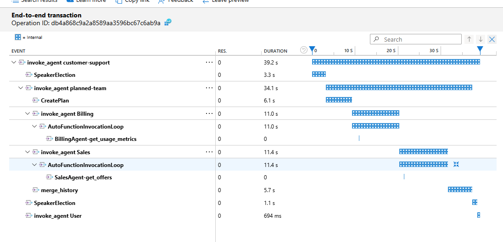
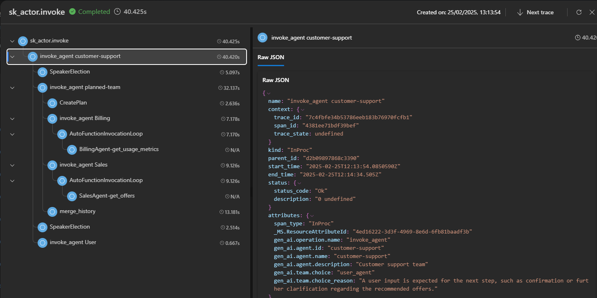
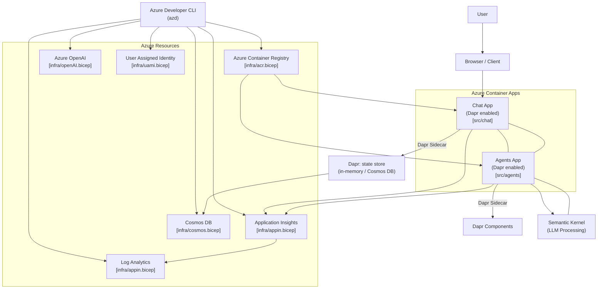

# Semantic Kernel Advanced Customer Support

This repo showcases a sample AI-enabled customer support application that leverages [Semantic Kernel](https://github.com/microsoft/semantic-kernel) Agents boosted with:

- an improved [`SelectionStrategy`](src/agents/sk_ext/speaker_election_strategy.py) that accounts for agents descriptions and available tools to provide a more accurate selection (including the reason for it for traceability).
- _nested orchestration_ via [`Teams`](src/agents/sk_ext/team.py) and `Agents` for more complex, hierarchical routing scenarios.
- a special type of `Agent` named [`PlannedTeam`](src/agents/sk_ext/planned_team.py), which can handle more complex, cross-agent asks turning them into a multi-step process automatically.
- improved telemetry and explainability via [Application Insights](https://learn.microsoft.com/en-us/azure/azure-monitor/app/app-insights-overview) to track agentic team steps and results, as well as the reasoning behind agent selection.

Additionally, the application leverages [Azure Container Apps](https://learn.microsoft.com/en-us/azure/container-apps/) and [Dapr](https://dapr.io) to enable the [_Virtual Actor pattern_](https://docs.dapr.io/developing-applications/building-blocks/actors/actors-overview/) for agentic teams and natively handle `ChatHistory` persistence via Dapr's [state store](https://docs.dapr.io/developing-applications/building-blocks/state-management/), ensuring that the application can scale seamlessly.

## Example

In this case, the user asks a question that requires the involvement of multiple agents, which are able to collaborate and produce a composite answer.


## Telemetry and explanability example

### Waterfall chart of agentic team steps (Application Insights)



### Additional debug information provided by the improved `SelectionStrategy`:


### Azure AI Foundry tracing

See [official documentation](https://learn.microsoft.com/en-us/azure/ai-foundry/tracing) for more details.



## Architecture

The overall architecture involves [Dapr](https://dapr.io) to enable the [_Virtual Actor pattern_](https://docs.dapr.io/developing-applications/building-blocks/actors/actors-overview/), in order to host the agentic team and natively handle `ChatHistory` persistence via Dapr's [state store](https://docs.dapr.io/developing-applications/building-blocks/state-management/).



## Getting Started

### Prerequisites

- **Python 3.12+**
- [**Azure Developer CLI**](https://learn.microsoft.com/en-us/azure/developer/azure-developer-cli/install-azd?tabs=winget-windows%2Cbrew-mac%2Cscript-linux&pivots=os-windows) – To deploy and manage Azure resources.
- **Docker** and [**Dapr CLI**](https://docs.dapr.io/getting-started/install-dapr-cli/) – To run the application locally.

### Clone the repo

```bash
git clone https://github.com/Azure-Samples/mas-sk-quickstart
cd mas-sk-quickstart
```

### Azure Deployment

> [!NOTE]
> Script will **NOT** create a new Azure OpenAI resource. You will need to have an existing one with a deployed model.

```bash
# Login to Azure if required
azd auth login --tenant-id <TENANT>.onmicrosoft.com

azd up

# When prompted, select
# - Azure subscription to deploy to
# - Azure region to deploy to
# - EXISTING Azure OpenAI resource and group to use (azd will NOT create a new one)
```

### Running Locally

> [!TIP]
> If you deployed the application to Azure, you can run it locally using the same Azure resources.
> Simply copy the `.env` file from the `.azure/<env name>` folder to the root of the repo.

1. `cp .env.example .env`
2. Update `.env` with your Azure OpenAI resource endpoint.
3. Ensure Docker is running.
4. Init Dapr (once only): `dapr init`.
5. Setup Python environment and install dependencies:

```bash
python -m venv .venv

# On macOS/Linux:
source .venv/bin/activate

# On Windows:
.venv\Scripts\Activate.ps1

pip install -r src/chat/requirements.txt
pip install -r src/agents/requirements.txt
```

To run:

`dapr run -f dapr.yaml`

## Contributing

This project welcomes contributions and suggestions. Please see [CONTRIBUTING.md](CONTRIBUTING.md) for details.

## License

This project is licensed under the MIT License. See [LICENSE.md](LICENSE.md) for details.
