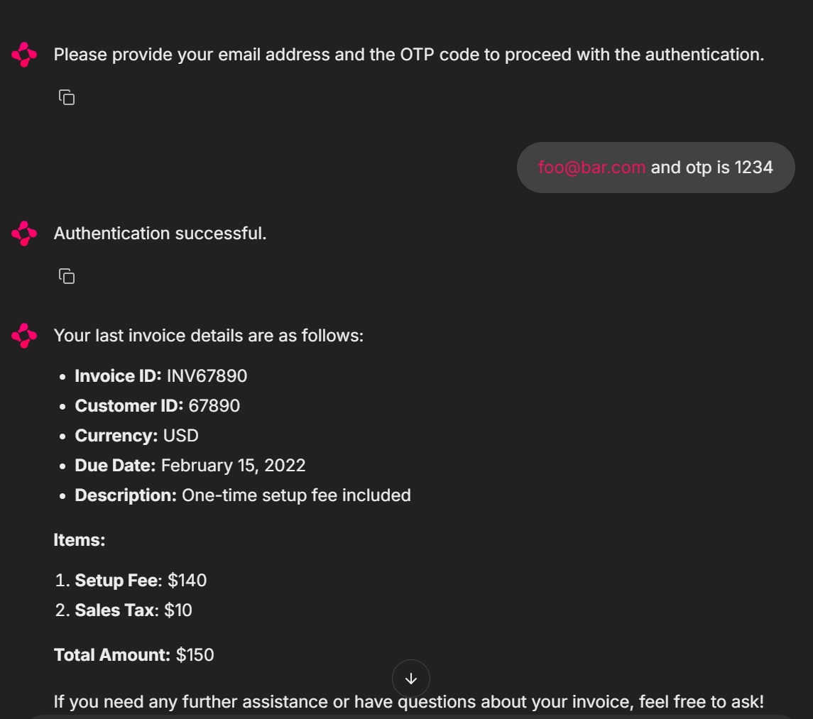

# Authentication Context

This example demonstrates how to persist "hidden" information in the `ChatHistory` to maintain additional context for the system, like the user being authenticated and its ID for later use (ex. in function calls).



## Rationale

Authentication is a common requirement for many applications. In a chatbot, it is important to know who the user is to provide a personalized experience, but user might begin the conversation without being authenticated. The system then needs to authenticate the user and maintain that context for the rest of the conversation, even after many rounds.

Other use cases are possible, like storing the user's preferences, or the current state of a multi-step process, etc...

## Implementation

Initially, we simply ask a specific agent to write a message with a special format to the `ChatHistory`, in particular after user has completed the authentication process. However, we don't want to expose this information to the user, so we use a `ChatHistoryReducer` on the frontend side to remove the message from the conversation.

This will make the "internal" `ChatHistory` different from the "external" one, which is the one shown to the user.

Still, this will not be sufficient to maintain the context as the conversation progresses, since newer message will be added and older ones will be less revelant. To solve this, we use another `ChatHistoryReducer` on the backend side to consolidate all the messages with the special format into a single message, which is then added to the `ChatHistory` as a single message. This also ensures only the latest information is kept.

## Running the example

```bash
python -m venv .venv

# On MacOS/Linux
.venv\Scripts\activate

# On Windows
.venv\Scripts\Activate.ps1

pip install -r requirements.txt

chainlit run -h --port 8081 .\chat.py
```
