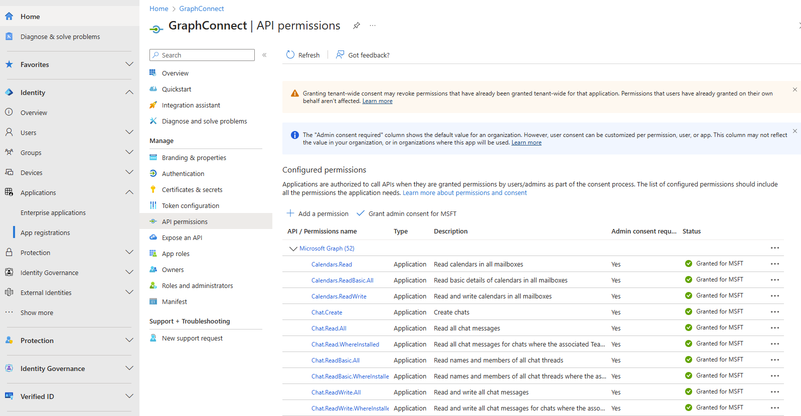

# Microsoft Copilot Agent with Semantic Kernel and Microsoft Graph APIs 

This app implements an Semantic Kernel-powered Copilot agent that integrates with Microsoft Graph APIs to help users interact with Microsoft 365 services directly through Teams conversations. Built on top of the [Teams AI library](https://aka.ms/teams-ai-library), it provides natural language interactions for managing emails, calendar, tasks, and other Microsoft 365 resources.

> Many thanks for Chris Arendt for providing the boilerplate template for the Copilot + Teams agent app with Semantic Kernel.

## Key Features

- **User Management**
  - List and search organization users
  - Find users by name or email
  - Cache user information for faster lookups
  - Manage user profiles and information

- **Email Operations**
  - Send emails with rich text content
  - Read and process inbox messages
  - Search emails across folders by content, subject, or sender
  - Access mail folder structure and filter messages
  - Search within specific folders

- **Todo Management**
  - Create and manage task lists
  - Add and track tasks
  - Set task priorities and due dates
  - Monitor task completion status

## Example Interactions

The bot understands natural language commands and can help with tasks like:

### User Management
- "Find users matching 'John'"
- "List the first 10 users in the organization"
- "Get details about user sarah@company.com"

### Email Operations
- "Send an email to marketing@company.com about the new feature launch"
- "Get my latest inbox messages"
- "Find all emails containing 'project deadline'"
- "Show me my unread emails from last week"
- "Search for emails with attachments in my inbox"

### Todo Management
- "Create a todo list for my project tasks"
- "Add a task to my work list"
- "Show me all my todo lists"

## Prerequisites

> **Prerequisites**
>
> To run the template in your local dev machine, you will need:
>
> - [Python](https://www.python.org/), version 3.8 to 3.11.
> - [Python extension](https://code.visualstudio.com/docs/languages/python), version v2024.0.1 or higher.
> - [Teams Toolkit Visual Studio Code Extension](https://aka.ms/teams-toolkit) latest version or [Teams Toolkit CLI](https://aka.ms/teams-toolkit-cli).
> - An account with [Azure OpenAI](https://aka.ms/oai/access).
> - A [Microsoft 365 account for development](https://docs.microsoft.com/microsoftteams/platform/toolkit/accounts).

## Configurations

1. If you do not have a demo M365 tenant, you can create one [here](https://developer.microsoft.com/en-us/microsoft-365/dev-program). This is needed for developing and deploying Copilot Agents.
1. Open the command box and enter `Python: Create Environment` to create and activate your desired virtual environment. Remember to select `src/requirements.txt` as dependencies to install when creating the virtual environment.
1. *IMPORTANT*: rename the `env.rename` folder to `env`
1. In file *env/.env.local.user*, fill in your Azure OpenAI key `SECRET_AZURE_OPENAI_API_KEY`, deployment name `AZURE_OPENAI_MODEL_DEPLOYMENT_NAME` and endpoint `AZURE_OPENAI_ENDPOINT`.
1. Register an application in Microsoft Entra ID using the following link: [App Registration](https://learn.microsoft.com/en-us/entra/identity-platform/quickstart-register-app?tabs=certificate%2Cexpose-a-web-api)
1. In file *.env* in the project root, fill in `clientId`, `clientSecret` and `tenantId` values. These are the values of the app you registered using Entra ID in the previous step.
1. Using the Entra Admin [portal](https://entra.microsoft.com/), please navigate to Applications > App Registrations > <YourApp>, and then navigate to API Permissions. Then click on `+ Add a permission`, then `Microsoft Graph`, then `Application Permissions`, and select the relevant permissions for the app. You will need at least the following:
    * Mail.Read
    * Mail.ReadBasic
    * Mail.ReadBasicAll
    * Mail.ReadWrite
    * Mail.Send
    * MailboxFolder.Read.All
    * MailboxItem.Read.All
    * MailboxSettings.Read
    * Tasks.Read.All
    * Tasks.ReadWrite.All
    * User.Read.All
    * User.ReadBasic.All
    * User.ReadWrite.All
1. As a last step, once all permissions are added, you will need to click on `Grant admin consent for MSFT` in the main view. 

## Conversation with bot

1. Select the Teams Toolkit icon on the left in the VS Code toolbar.
1. In the Account section, sign in with your [Microsoft 365 account](https://docs.microsoft.com/microsoftteams/platform/toolkit/accounts) if you haven't already.
1. Press F5 to start debugging which launches your app in Teams using a web browser. Select `Debug in Teams (Edge)` or `Debug in Teams (Chrome)`.
1. When Teams launches in the browser, select the Add button in the dialog to install your app to Teams.
1. You will receive a welcome message from the bot, or send any message to get a response.

**Congratulations**! You are running an application that can now interact with users in Teams:

> For local debugging using Teams Toolkit CLI, you need to do some extra steps described in [Set up your Teams Toolkit CLI for local debugging](https://aka.ms/teamsfx-cli-debugging).

## Solution Architecture

The solution consists of several key components:

| Component | Purpose |
|-----------|---------|
| `GraphAgent` | Core class that handles Microsoft Graph API interactions |
| `MicrosoftGraphPlugin` | Semantic Kernel plugin that wraps Graph functionality |
| `TeamsBot` | Teams interface that processes messages and manages conversations |

### Key Source Files

| File | Description |
|------|-------------|
| `src/graph_agent.py` | Implements Microsoft Graph API functionality |
| `src/graph_agent_plugin.py` | Semantic Kernel plugin for AI integration |
| `src/teamsBot.py` | Teams bot implementation |

## What's included in the template

| Folder       | Contents                                            |
| - | - |
| `.vscode`    | VSCode files for debugging                          |
| `appPackage` | Templates for the Teams application manifest        |
| `env`        | Environment files                                   |
| `infra`      | Templates for provisioning Azure resources          |
| `src`        | The source code for the application                 |

The following files can be customized and demonstrate an example implementation to get you started.

| File                                 | Contents                                           |
| - | - |
|`src/app.py`| Hosts an aiohttp api server and exports an app module.|
|`src/teamsBot.py`| Handles business logics for the AI Agent.|
|`src/config.py`| Defines the environment variables.|

The following are Teams Toolkit specific project files. You can [visit a complete guide on Github](https://github.com/OfficeDev/TeamsFx/wiki/Teams-Toolkit-Visual-Studio-Code-v5-Guide#overview) to understand how Teams Toolkit works.

| File                                 | Contents                                           |
| - | - |
|`teamsapp.yml`|This is the main Teams Toolkit project file. The project file defines two primary things:  Properties and configuration Stage definitions. |
|`teamsapp.local.yml`|This overrides `teamsapp.yml` with actions that enable local execution and debugging.|
|`teamsapp.testtool.yml`|This overrides `teamsapp.yml` with actions that enable local execution and debugging in Teams App Test Tool.|

## Extend the template

You can follow [Build an AI Agent in Teams](https://aka.ms/teamsfx-ai-agent) to extend the AI Agent template with more AI capabilities, like:
- [Add functions](https://aka.ms/teamsfx-ai-agent#add-functions-build-new)

## Additional information and references

- [Teams Toolkit Documentations](https://docs.microsoft.com/microsoftteams/platform/toolkit/teams-toolkit-fundamentals)
- [Teams Toolkit CLI](https://aka.ms/teamsfx-toolkit-cli)
- [Teams Toolkit Samples](https://github.com/OfficeDev/TeamsFx-Samples)

## Known issue

- If you use `Debug in Test Tool` to local debug, you might get an error `InternalServiceError: connect ECONNREFUSED 127.0.0.1:3978` in Test Tool console log or error message `Error: Cannot connect to your app,
please make sure your app is running or restart your app` in log panel of Test Tool web page. You can wait for Python launch console ready and then refresh the front end web page.
- When you use `Launch Remote in Teams` to remote debug after deployment, you might loose interaction with your bot. This is because the remote service needs to restart. Please wait for several minutes to retry it.