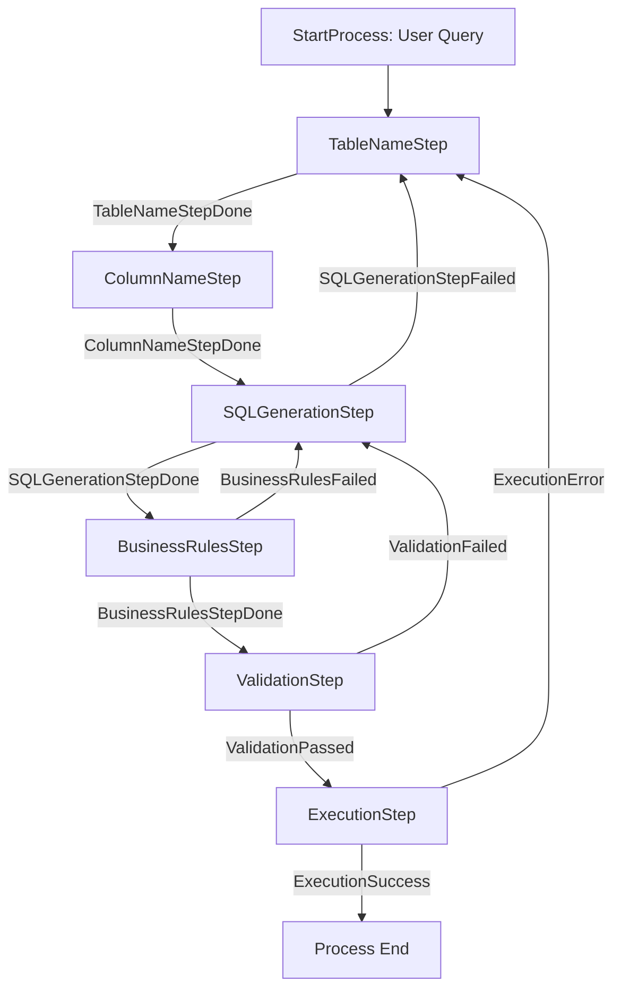

# Bridging Business and Technology: Transforming Natural Language Queries into SQL with Semantic Kernel

This article has been written by Samer El Housseini, Riccardo Chiodaroli, Daniel Labbe and Fabrizio Ruocco. The authors are part of the EMEA AI GBB Strategic X-pod. 

## Introduction

In today's data-driven business landscape, access to information is critical for decision-making. However, a persistent challenge has been the technical barrier between business users who need data insights and the complex database systems that house this information. The solution? Natural Language to SQL (NL2SQL) technology - a transformative approach that allows users to query databases using everyday language rather than complex SQL syntax.

In this article, we'll explore how Microsoft's Semantic Kernel framework provides a powerful foundation for building an innovative NL2SQL system. We'll examine both the business value this brings to organizations and the technical implementation details that make it possible.

## Part 1: The Business Case for Natural Language to SQL

### Breaking Down Technical Barriers

Consider this common scenario: A business analyst needs to understand "What is the average wellness index for patients with chronic conditions?" Traditionally, this would require either:

1. Learning SQL and database structure
2. Submitting a request to the IT department and waiting
3. Using limited pre-built reporting tools

None of these options is ideal. The first requires significant time investment, the second creates bottlenecks, and the third lacks flexibility. NL2SQL eliminates these barriers by allowing business users to simply ask questions in plain English.

### Measurable Business Impact

The NL2SQL approach delivers several quantifiable benefits:

1. **Accelerated Decision-Making**: By removing the technical intermediary, insights can be obtained in minutes rather than days.
  
2. **Resource Optimization**: IT teams can focus on higher-value activities rather than servicing routine data requests.

3. **Democratized Data Access**: More employees can leverage data, creating a more informed organization.

4. **Improved Data Governance**: Business rules are systematically enforced in the system at query time, ensuring consistently compliant queries.

### Real-World Applications

Healthcare organizations can use this technology to quickly analyze patient outcomes, insurance providers can assess coverage patterns, and pharmaceutical companies can evaluate medication adherence - all without specialized database knowledge. The application is particularly powerful in regulated industries where both speed and compliance are essential. These examples can be extended to any industry for any database-related use case.

## Part 2: The Technical Architecture: Building a State Machine for NL2SQL with Semantic Kernel

Now, let's dive into the technical implementation of this powerful system. The architecture leverages Microsoft's Semantic Kernel Process Framework to create a sophisticated state machine that handles the complex task of translating natural language to SQL.

### The Semantic Kernel Process Framework

Semantic Kernel provides a structured way to build AI-powered applications with a process-oriented approach. This project leverages Semantic Kernel's Process builder to create a state machine where:

1. Each step in the NL2SQL conversion is a distinct process step
2. Events trigger transitions between steps
3. The entire workflow manages state and handles failures gracefully

The result is a robust system that can iteratively refine queries until they meet both syntactic and semantic requirements.

### Innovative Multi-Stage Processing

What makes this NL2SQL implementation particularly innovative is its multi-stage approach:

1. **Table Identification**: First determining which database tables are relevant to the query
2. **Column Extraction**: Then identifying specific columns needed from those tables identifid in the previous step
3. **SQL Generation**: Creating the initial SQL statement
4. **Syntactic Validation**: Verifying SQL correctness
5. **Business Rule Validation**: Ensuring compliance with business semantics
6. **Execution**: Running the validated query

This approach solves a key challenge in NL2SQL systems - balancing the need to understand what data is available (tables/columns) with how to properly query it (syntax/semantics).



### The State Machine Implementation

Let's examine the core components of the implementation:

```python
def get_sql_process(self) -> KernelProcess:
    """Build and configure the SQL generation process with all steps and their transitions."""
    process = ProcessBuilder(name="SQLGenerationProcess")

    # Add steps to the process
    table_step = process.add_step(TableNameStep)
    column_step = process.add_step(ColumnNameStep)
    sql_generation_step = process.add_step(SQLGenerationStep)
    business_rules_step = process.add_step(BusinessRulesStep)
    validation_step = process.add_step(ValidationStep)
    execution_step = process.add_step(ExecutionStep)

    # Define the process flow
    process.on_input_event(event_id=SQLEvents.StartProcess).send_event_to(target=table_step, parameter_name="data")
    
    table_step.on_event(event_id=SQLEvents.TableNameStepDone).send_event_to(
        target=column_step, parameter_name="data"
    )
    
    column_step.on_event(event_id=SQLEvents.ColumnNameStepDone).send_event_to(
        target=sql_generation_step, parameter_name="data"
    )
    
    # ...additional event flow definitions...

    return process.build()
```

This elegant process definition creates a workflow where:

1. The process starts by identifying tables
2. On successful table identification, it moves to column identification
3. With tables and columns identified, it generates SQL
4. The SQL undergoes business rule validation
5. Then syntax validation
6. Finally, execution if all validations pass

Most importantly, the system includes feedback loops. If validation fails at any stage, the process can return to an earlier step with information about what went wrong, enabling iterative refinement.

### Prompting Excellence: The Secret to Effective NL2SQL

At the heart of this system are carefully designed prompts that guide the language model through each step. Through iterative and repeated refinements, these prompts have been drafted and were evolved to make sure that the system **converges** on a solution to generate a proper SQL statement. Let's examine one of these prompts:

```python
get_table_names_prompt_template = """
## Instructions:
You are an advanced SQL query generator. Your task is to extract the relevant table names using the following **natural language question** from a list of business tables. 

You **MUST** take a conservative approach: if in doubt whether a table is relevant or not, then you need to include it in the list. It is better to have it and not need it than to need it and not have it. Make sure to review the Business Rules when deciding on the table names.

Make sure to include all foreign keys and relationships that are relevant to the user's question that are necessary to join the tables. If the tables do not have direct relationships, please analyze the situation and include any intermediary tables that can join the tables, and might be necessary to answer the user's question.

## **Business Rules**
{rules}

## User Query
{user_query}

## START OF LIST OF TABLES
{table_list}
## END OF LIST OF TABLES

# **Inputs from previous generation rounds**
...
"""
```

This prompt is structured to:
1. Precisely define the task (extract table names)
2. Provide context (business rules, available tables)
3. Include previous generation attempts for refinement
4. Specify the expected output format

Similar specialized prompts exist for each step in the process, ensuring the language model understands exactly what's needed at each stage.

### Handling Errors and Refining Results

A particularly powerful aspect of this system is its ability to learn from failures through the state machine's feedback loops:

```python
business_rules_step.on_event(event_id=SQLEvents.BusinessRulesFailed).send_event_to(
    target=sql_generation_step, parameter_name="data"
)

validation_step.on_event(event_id=SQLEvents.ValidationFailed).send_event_to(
    target=sql_generation_step, parameter_name="data"
)

execution_step.on_event(event_id=SQLEvents.ExecutionError).send_event_to(
    target=table_step, parameter_name="data"
)
```

When a validation or execution fails, the system captures error details and feeds them back into earlier steps. This creates an iterative refinement process that can solve complex queries that might fail on the first attempt.

For example, if business rule validation fails, the system doesn't simply report an error - it returns to SQL generation with notes about what rules were violated, allowing for targeted improvements.

## Part 3: Data Structures - The Foundation of Intelligent SQL Generation

At the core of this NL2SQL system are several carefully designed data structures that power the various stages of query processing. These structures provide the essential context needed for the system to understand database schema, enforce business rules, and produce accurate SQL queries.

### Table Descriptions: The First Layer of Understanding

The system begins its process with a comprehensive set of table descriptions that provide high-level information about each database entity. This structure is critical for the initial table identification step, allowing the system to determine which tables might be relevant to a user's query.

Each table description includes:
- The table name (e.g., "HC_Patient_Daily_Summary_v3")
- A detailed narrative description of the table's purpose and contents
- Information about relationships with other tables through foreign keys

For example, when a user asks about "medication adherence for patients with chronic conditions," the system can quickly identify that both the medication summary and patient summary tables are likely relevant based on these descriptions.

### Database Schema Model: Detailed Column-Level Knowledge

Once relevant tables are identified, the system leverages a more detailed schema model that includes comprehensive information about each column within those tables. This model provides:

- Column names and data types
- Detailed descriptions of what each column represents
- Valid value ranges or enumerations
- Foreign key relationships between tables

This rich column-level information enables the system to select appropriate columns for the query, understand data types for proper syntax, and establish necessary joins between related tables. It's particularly valuable during the column identification step and subsequent SQL generation.

### Business Rules: Semantic Intelligence Layer

Perhaps the most distinctive aspect of this NL2SQL system is its integration of business rules that add a semantic intelligence layer to query generation. These rules are structured as conditions and actions, with each rule having:

- A unique identifier (e.g., "HC1")
- A name (e.g., "Chronic Condition Filtering")
- A condition that triggers the rule
- An action to take when the condition is met

For example, when a query mentions high-risk patients, the system knows to apply specific filtering criteria. This is **codified business knowledge** that only the organization can collect and compile to serve as Business Rules for the SQL generation process. 

These rules ensure that generated queries adhere to the business's understanding of data semantics. The business rules are evaluated during the dedicated Business Rules step in the process, providing a critical validation layer before execution.

### The Power of Integrated Data Structures

What makes this approach particularly effective is how these data structures work together through the state machine:

1. **Table Descriptions** enable quick, high-level identification of relevant tables
2. **Database Schema Model** provides the detailed column information needed for precise query construction
3. **Business Rules** ensure semantic correctness beyond just syntactic validity

Through this layered approach to data modeling, the system can progressively refine its understanding of what the user is asking for and how to represent it correctly in SQL. The feedback loops in the state machine allow the system to revisit these data structures as needed when validation issues arise, creating a robust and self-correcting query generation system.

This architecture demonstrates how comprehensive data modeling combined with a process-oriented approach can create an AI system that bridges the gap between natural language questions and technically correct, semantically appropriate database queries.

## Part 4: Example Run

In the repo, we have provided a testing SQLite database that comes with complete synthetic generated data. The database implements a comprehensive healthcare monitoring system that tracks patient health data through connected medical devices. It integrates daily patient summaries with detailed information about medications, devices, insurance plans, and providers to support remote patient monitoring, medication adherence tracking, and healthcare accessibility analysis. 

You can note that the below generated SQL statement has a SQLite *dialect*. This is by design, for this demo scenario. The SQL dialect can easily be changed in the prompts to adapt to whatever database this solution is connected to.

Using our solution, we have asked it the following question: `"Find the medication adherence level distribution for elderly patients (age 65+)"`.

Checking the successful execution run using OpenAI's `o3-mini` model, the flow went from **StartProcess** → **TableNameStep** → **ColumnNameStep** → **SQLGenerationStep** → **BusinessRulesStep** → **ValidationStep** → **ExecutionStep** → **ExecutionSuccess** → **Process End**, without any loops or errors. The query was not overly complex, and required only one JOIN between 2 tables. 

Below are the reformatted logs for better readability: 
```python
    StartProcess: User Query
    -> "Find the medication adherence level distribution for elderly patients (age 65+)"

    >> Running TableNameStep...
        Extracted table names:
            - HC_Patient_Daily_Summary_v3
            - HC_Patient_Medication_Summary_v3
        Emitted event: TableNameStepDone.

    >> Running ColumnNameStep...
        Extracted column names for HC_Patient_Medication_Summary_v3:
            - ADHERENCE_LEVEL, PATIENT_ID, PROVIDER_ID, MEDICATION_ID, RECORD_DATE, PRESCRIPTION_ID
        Extracted column names for HC_Patient_Daily_Summary_v3:
            - PATIENT_ID, INSURANCE_REC.PATIENT_AGE_GROUP_CD, RECORD_DATE
        Emitted event: ColumnNameStepDone.

    >> Running SQLGenerationStep...
        Generated SQL statement:
            SELECT
            HC_Patient_Medication_Summary_v3.ADHERENCE_LEVEL,
            COUNT(DISTINCT HC_Patient_Medication_Summary_v3.PATIENT_ID) AS PATIENT_COUNT
            FROM HC_Patient_Medication_Summary_v3
            JOIN HC_Patient_Daily_Summary_v3
            ON HC_Patient_Medication_Summary_v3.PATIENT_ID = HC_Patient_Daily_Summary_v3.PATIENT_ID
            WHERE HC_Patient_Daily_Summary_v3."INSURANCE_REC.PATIENT_AGE_GROUP_CD" = '65+'
            GROUP BY HC_Patient_Medication_Summary_v3.ADHERENCE_LEVEL
        Emitted event: SQLGenerationStepDone.

    >> Running BusinessRulesStep...
        All business rules validated: OK
        Emitted event: BusinessRulesStepDone.

    >> Running ValidationStep...
        SQL syntax and structure validated: OK
        Emitted event: ValidationPassed.

    >> Running ExecutionStep...
        Executing SQL...
        Results:
            - High:   588
            - Medium: 723
            - Low:    16
        Emitted event: ExecutionSuccess.

    Process completed!

    >> Final Answer:
        Among elderly patients (age 65+), there are:
            - 588 patients with High adherence
            - 723 patients with Medium adherence
            - 16 patients with Low adherence
```

## Part 5: Performance Considerations and Future Improvements

While the state machine approach for NL2SQL represents a significant advancement over traditional techniques, it's important to acknowledge its current performance characteristics and areas for improvement.

### Current Performance Profile

The performance of this innovative approach varies considerably based on database complexity:

- **Simple Databases**: For schemas with 5-10 tables with straightforward relationships and minimal business rules, the system achieves impressive accuracy (~90%), especially when leveraging more efficient models like O3-mini rather than GPT-4o. These simpler contexts allow the state machine to quickly converge on correct solutions with fewer iterations.

- **Complex Databases**: For enterprise-level databases with tens to hundreds of tables, hundreds of columns per table, and complex business rules, performance drops significantly. The multi-step process may require more iterations through feedback loops, and the increased context complexity challenges even advanced language models.

### Comparative Advantage

Despite these limitations, extensive experimentation has demonstrated that this process-oriented approach consistently outperforms one-shot approaches using "mega prompts" that attempt to solve the entire problem at once. The advantages include:

1. **Focused Context**: Each step works with only the most relevant subset of information rather than overwhelming the model with the entire database schema and all business rules.

2. **Error Recovery**: The feedback loops allow the system to learn from mistakes and iteratively improve, rather than failing completely on the first error.

3. **Transparent Debugging**: The state machine approach makes it easier to identify exactly where in the process errors occur, facilitating targeted improvements.

### Future Improvement Paths

Several promising avenues for improving system performance including implementing more sophisticated schema representation techniques could improve the system's ability to understand complex database structures:
- Graph-based schema representations that better capture entity relationships
- Pre-computed embeddings of table and column descriptions for faster semantic matching (Azure AI Search + RAG)
- Hierarchical schema representations that group related entities

### Conclusion on Performance

The state machine approach represents a valuable architectural pattern for tackling the complexity of NL2SQL systems. While current performance has room for improvement, especially with complex databases, the fundamental pattern of breaking down the problem, enabling feedback loops, and progressively refining solutions provides a solid foundation for future advancements.

As language models continue to evolve in capability and efficiency, this architecture is well-positioned to take advantage of those improvements while maintaining its core strengths in managing complexity and providing transparent, iterative refinement.

## Conclusion: The Future of Data Interaction

The NL2SQL system built with Semantic Kernel represents a significant advancement in how businesses can interact with their data. By bridging the gap between natural language and database queries, it empowers non-technical users to harness the full power of their organization's data assets.

What makes this implementation particularly effective is the combination of:

1. **Incremental processing**: Breaking the complex task into manageable steps
2. **Iterative refinement**: Using feedback loops to improve results
3. **Semantic understanding**: Applying both syntactic and business rule validation
4. **Structured workflow**: Leveraging Semantic Kernel's process framework
5. **Smart Data Structures**: Using smart data structures that feed language models the right information at the right time withing their context window limits

As language models continue to advance, this type of system will become increasingly powerful, potentially eliminating the need for SQL knowledge entirely in many business contexts.

For organizations looking to democratize data access while maintaining governance controls, an NL2SQL system built on Semantic Kernel provides an elegant solution that balances accessibility with compliance - bringing us one step closer to truly conversational interaction with databases.


### Wan to Learn More?

* Semantic Kernel Advanced Usage Repo: [Link](https://github.com/Azure-Samples/semantic-kernel-advanced-usage)
* Implementation Details of the NL2SQL Use Case: [Link](https://github.com/Azure-Samples/semantic-kernel-advanced-usage/tree/main/templates/natural_language_to_SQL)
* Contact: Reach out to our Strategic X-Pod

