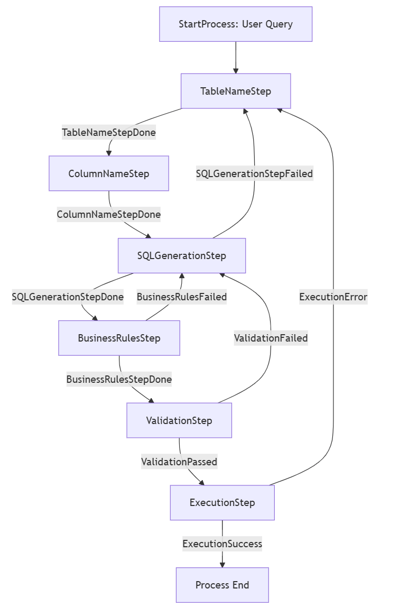

# NLQ to SQL State Machine

## Overview

The NLQ to SQL project is an advanced system that converts natural language queries into executable SQL statements using a state machine architecture. This solution is designed for businesses that require rapid, accurate, and dynamic query generation from plain English queries to query relational databases directly without deep technical SQL knowledge.

## Business Impact

- **Rapid Decision Making:** By converting everyday language into SQL queries, business users can quickly retrieve the data they need without dependency on IT departments or database experts.
- **Cost Efficiency:** Reduces human errors and minimizes the overhead of manual query writing, saving both time and resources.
- **Accessibility:** Makes data analytics accessible to a broader audience by lowering the technical barriers to database querying.
- **Improved Accuracy:** Leverages business rules to ensure that queries adhere to required data governance and best practices, resulting in more reliable data outputs.

## How It Works

The project utilizes a state machine to manage the flow of query processing. Key components include:

1. **Natural Language Processing:** Takes input queries from users and interprets them into structured formats.
2. **Table and Column Identification:** Determines the relevant tables and columns based on the customer query and existing data models.
3. **SQL Generation:** Converts the processed information into a valid SQL query, applying business rules to maintain query accuracy and context.
4. **Validation & Execution:** Ensures the generated SQL complies with business rules and database grammar before execution.

The architecture is modular, with distinct modules for managing business rules, data models, prompt generation, and core processing, all integrated into one cohesive application workflow.





## Project Structure

- **src/**: Contains all core source code including modules for processing, steps, and utils.
- **scripts & notebooks:**: Sample projects and experiments.


## How to Run the Project

1. **Install Dependencies**: Ensure you have Python installed. Install required packages using:
   ```bash
   pip install -r requirements.txt
   ```

2. **Set up Environment Variables**: Configure environment variables in the `.env` file according to your deployment and authentication needs.

3. **Run the Application**: Execute the main script from the command line by providing a natural language query string:
   ```bash
   python src/main.py "Your natural language query here"
   ```
   This will initiate the NL2SQL process, generate the corresponding SQL statement, and run the query against the target database.

4. **Review Output**: The results of the query will be displayed in the console, and any prompt outputs will be stored in the `output_prompts/` directory.

5. **Launch the UI**: as a second option, you can also launch the UI with the below command to see the solution in realtime, and then browse to [http://localhost:80/](http://localhost:80/)

   ```bash
   python src/server.py
   ```

<br/>
<br/>


<br/>
<br/>


## Conclusion

This project bridges the gap between non-technical users and database management systems. By allowing users to simply ask questions in natural language and receive accurate SQL queries, it facilitates agile business intelligence and supports data-driven decision-making processes.

For more detailed technical configurations and advanced use cases, please refer to the inline documentation across the codebase.

## Environment variables:

Please rename the `.env-sample` file to `.env`, and then supply the required values. 

## Requirements:

- Python 3.12+
- AzureOpenAI
- Libraries in `requirements.txt`
