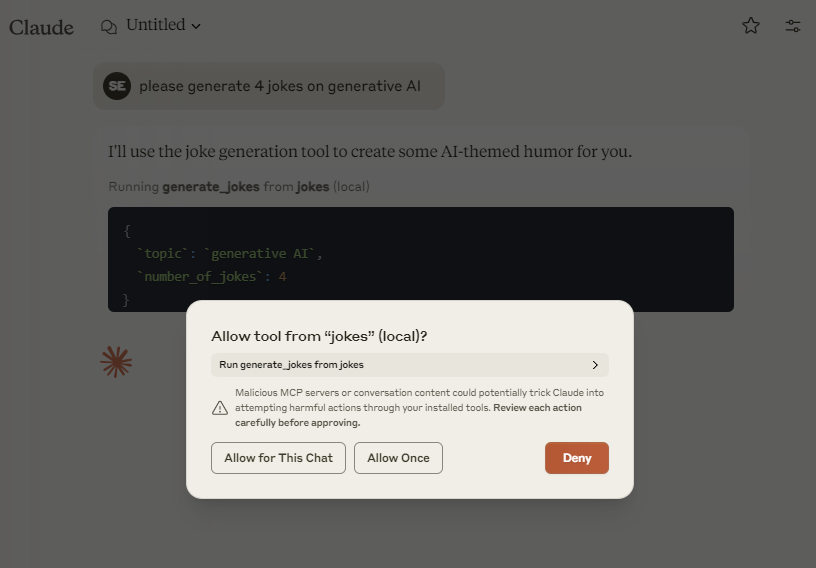
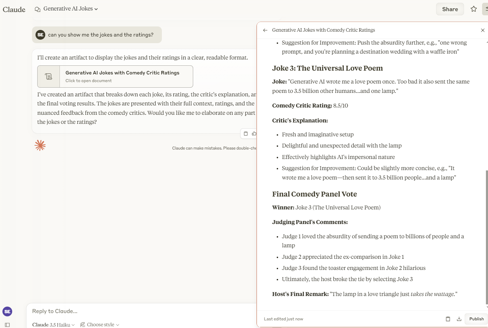

# Jokes MCP Server

**Jokes MCP Server** uses SK Agents (via the Semantic Kernel) to generate and evaluate jokes. It is built on the Model Context Protocol (MCP) using the Python MCP SDK and integrates with Azure OpenAI for LLM-powered interactions.

## Table of Contents

- [Prerequisites](#prerequisites)
- [Setup & Installation](#setup--installation)
- [Environment Configuration](#environment-configuration)
- [Running the Server](#running-the-server)
- [Debugging with MCP Inspector](#debugging-with-mcp-inspector)
- [Testing with MCP Hosts](#testing-with-mcp-hosts)
- [Troubleshooting](#troubleshooting)
- [Next Steps](#next-steps)

## Prerequisites

- **Python 3.10+** – Ensure you have Python 3.10 or higher installed.
- **pip** – Python’s package installer.
- **MCP Python SDK** – Provides the MCP server functionality.
- **Semantic Kernel SDK** – For creating and managing LLM agents.
- **python-dotenv** – For loading environment variables from a `.env` file.
- **Other dependencies:** `httpx` (for asynchronous HTTP requests).

## Setup & Installation

1. **Clone or copy the project files** into your project directory (for example, in a file named `sk_mcp_example.py`).

2. **Create and activate a virtual environment:**

   ```bash
   python -m venv .venv
   # On macOS/Linux:
   source .venv/bin/activate
   # On Windows:
   .venv\Scripts\activate
   ```

3. **Install dependencies.**  
   Please use the existing `requirements.txt`, then run:

   ```bash
   pip install -r requirements.txt
   ```

   > **Note:** The MCP package should be version 1.2.0 or higher. Check the [MCP documentation](https://modelcontextprotocol.io/quickstart/server) for any updates.

## Environment Configuration

Create a `.env` file in your project root with the following variables. Please check the `.env.sample` file:

```env
GLOBAL_LLM_SERVICE="AzureOpenAI"
AZURE_OPENAI_DEPLOYMENT_NAME=your_deployment_name
AZURE_OPENAI_ENDPOINT=https://your-openai-endpoint
AZURE_OPENAI_API_KEY=your_api_key
AZURE_OPENAI_API_VERSION="2024-12-01-preview"
```

These environment variables are used to initialize the Azure OpenAI connector in your SK Agents.

## Running the Server

Your Python script already initializes a FastMCP server and registers two tools (`get_alerts` and `get_forecast`). To run the server locally, execute:

```bash
python sk_mcp_example.py
```

Alternatively, if you use the `uv` command (from the [uv tool](https://astral.sh/uv/install.sh)) as recommended in the MCP quickstart:

```bash
uv run sk_mcp_example.py
```

This command will start the MCP server with a stdio transport.

## Debugging with MCP Inspector

The **MCP Inspector** is an interactive tool for testing and debugging your MCP server. To use it:

1. **Ensure Node.js is installed** on your system.
2. Run the Inspector from your terminal by pointing it to your Python server file:

   ```bash
   npx @modelcontextprotocol/inspector python sk_mcp_example.py
   ```

   By default, the Inspector starts a web client on port `5173` and an MCP proxy on port `3000`.  
3. **Open your browser** and navigate to `http://localhost:5173` to view the Inspector UI.  
4. **Use the Inspector tabs** (Server Connection, Resources, Prompts, Tools, and Notifications) to:
   - Verify your server’s connectivity.
   - Inspect tool schemas and test tool execution.
   - Monitor logs and notifications to help diagnose issues.

For more details on using the Inspector, refer to the [MCP Inspector documentation](https://modelcontextprotocol.io/docs/tools/inspector).

## Testing with MCP Hosts

To test your server using an MCP host like **Claude for Desktop**, add an entry to the Claude Desktop configuration file:

1. Open (or create) the configuration file:
   - **macOS/Linux:** `~/Library/Application Support/Claude/claude_desktop_config.json`
   - **Windows:** `%APPDATA%\Claude\claude_desktop_config.json`

2. Add your server configuration with an absolute path:

   ```json
   {
     "mcpServers": {
       "jokes": {
         "command": "uv",
         "args": [
           "--directory",
           "/ABSOLUTE/PATH/TO/PARENT/FOLDER",
           "run",
           "sk_mcp_example.py"
         ]
       }
     }
   }
   ```

3. Save the file and restart Claude for Desktop. The MCP tools (hammer icon) should now display your two tools:  
   - *generate_jokes* (to generate jokes)
   - *review_jokes* (to review jokes)
   - *vote_on_jokes* (to vote on jokes)

Try sending commands such as:
- "Please generate for me 5 dad jokes."
- "Please rate the previous jokes you have just generated."

## Troubleshooting

- **Server Not Starting:**  
  Ensure your virtual environment is active and that all dependencies are correctly installed.

- **No Tools Showing in MCP Host:**  
  - Verify that your configuration file (`claude_desktop_config.json`) has the correct absolute path.
  - Restart the MCP host (Claude for Desktop) after saving changes.

- **Tool Execution Fails:**  
  - Check server logs (located in your terminal output or in Claude’s log files at `~/Library/Logs/Claude/mcp*.log`).
  - If you receive an API rate limit or coordinate error, double-check the request parameters.

- **Inspector Debugging:**  
  Use the Inspector’s Notifications pane to view real-time logs. If tool calls fail, the error messages provided can help pinpoint issues such as missing arguments or API call failures.

## Next Steps

- **Build a Client:**  
  Learn how to build your own MCP client that connects to this server (see [Building MCP with LLMs](https://modelcontextprotocol.io/tutorials/building-mcp-with-llms)).

- **Enhance the Server:**  
  Consider adding more tools or resources, such as additional joke categories or a tool to review jokes (as shown in the code).

- **Explore the MCP Ecosystem:**  
  Check out additional example servers and clients in the [MCP Quickstart Resources repository](https://github.com/modelcontextprotocol/quickstart-resources).

## License

Distributed under the MIT License. See `LICENSE` for more information.


## References

1. https://modelcontextprotocol.io/quickstart/server
1. https://modelcontextprotocol.io/tutorials/building-mcp-with-llms
1. https://modelcontextprotocol.io/docs/tools/inspector

## Run Results

Here are some examples of the Joke MCP Server in action:

### MCP Tools in Claude
After connecting, Claude will display the available MCP tools:


### Tool Authorization in Claude
When using the MCP server with Claude, you'll see a prompt to authorize the tools:




### Sample Results
Here's an example of joke generation and review results:




